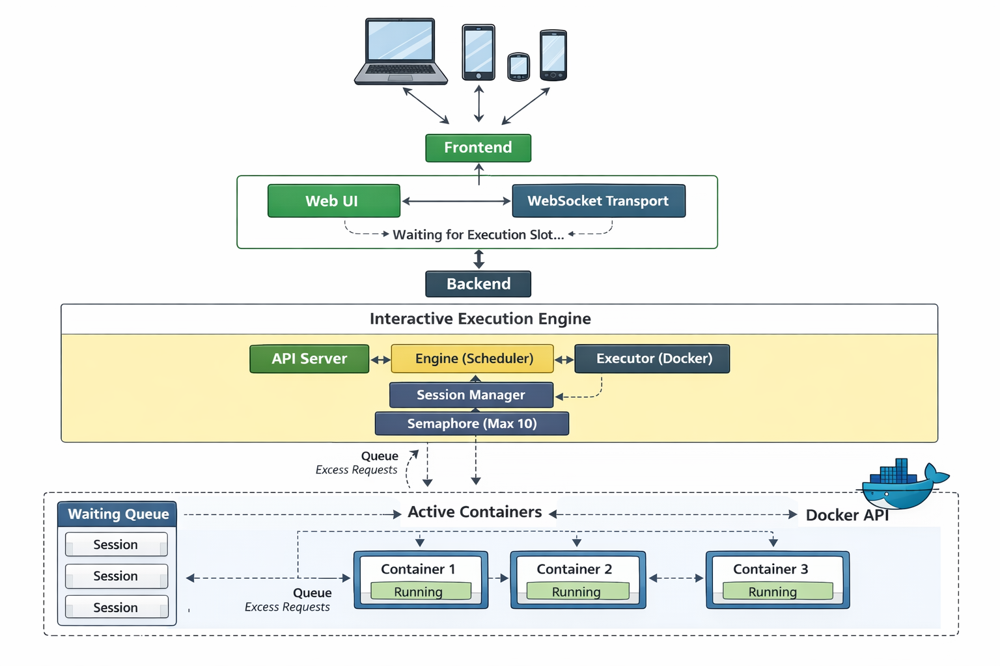

# 🧪 Interactive Code Execution Engine (Sandboxed)

A **production-grade, interactive code execution engine** built in **Go**, designed to safely run untrusted user code inside **isolated Docker containers** with **real-time stdin/stdout streaming over WebSockets**.

This system handles the complexity of managing untrusted code execution, similar to the internal engines of **online IDEs, coding interview platforms (like LeetCode/HackerRank), and cloud sandboxes**.

---

## ✨ Features

- ⚡ **Interactive Execution**
  - Real-time streaming of `stdin`, `stdout`, and `stderr`.
  - Supports interactive user input during execution (not just batch processing).
- 🔌 **WebSocket-based Streaming**
  - Live output chunks are pushed immediately to the client.
- 🌍 **Multi-Language Support**
  - Python (3.11)
  - JavaScript (Node.js 20)
  - Java (OpenJDK 21)
  - C++ (GCC)
- 🐳 **Strong Docker Isolation**
  - Every execution runs in a disposable, ephemeral container.
  - Uses **Docker-in-Docker (DinD)** concepts for scalable deployment.
- 🔐 **Hardened Sandbox**
  - Limits on CPU, memory, process count (PIDs), and disk usage.
  - Network access disabled to prevent abuse.
  - Read-only root filesystems and dropped capabilities.
- 🧼 **Automatic Cleanup**
  - Robust resource management ensures containers and temporary files are always cleaned up, even on crashes.
- 🛑 **Graceful Shutdown**
  - The server waits for active sessions to finish before shutting down.

---

## 🛡️ Security & Sandboxing

The engine is hardened against **common sandbox attacks**:

| Threat                   | Protection                          |
| ------------------------ | ----------------------------------- |
| **Fork Bombs**           | Strict `PidsLimit` (32)             |
| **CPU Exhaustion**       | `NanoCPUs` (0.5 core)               |
| **Memory Bombs**         | Hard memory limit (200MB)           |
| **Disk Filling**         | `tmpfs` workspace (32MB)            |
| **Network Abuse**        | Network completely disabled         |
| **Privilege Escalation** | `CapDrop: ALL`, `no-new-privileges` |
| **Infinite Loops**       | Idle & Execution timeouts           |
| **Output Flooding**      | Output size cap (1MB)               |

---

## 🧠 Architecture Overview



```
       +------------------+
       | Browser / Client |
       +--------+---------+
                ^
                | WebSocket (Stdin / Stdout / Stderr)
                v
       +--------+---------+
       |   HTTP + WS API  |  <-- /session, /ws/session/:id
       +--------+---------+
                |
                v
       +--------+---------+
       |      Engine      |  <-- Orchestrator (Session Registry)
       +--------+---------+
                |
                v
       +--------+---------+
       |      Session     |  <-- Lifecycle (Timeouts, Buffers, State)
       +--------+---------+
                |
                v
       +--------+---------+
       | Docker Executor  |  <-- Container Management
       +--------+---------+
                | Spawns
                v
       +--------+---------+
       | Isolated Container|  <-- Python/Node/Java/C++ Runtime
       +------------------+
```

### Key Components

- **Engine**: The central orchestrator that manages the lifecycle of all sessions.
- **Session**: Represents a single execution instance. It handles state transitions, timeouts, and buffers.
- **Executor**: The interface to the container runtime (Docker). It handles the low-level details of container creation, attachment, and cleanup.

---

## 🚀 Getting Started

### Prerequisites

- **Docker** (must be installed and running)
- **Git**

### Running with Docker Compose (Recommended)

This is the easiest way to run the application, as it handles the "Docker-in-Docker" configuration automatically.

1.  **Clone the repository:**

    ```bash
    git clone https://github.com/your-username/interactive-execution-engine.git
    cd interactive-execution-engine
    ```

2.  **Start the application:**

    ```bash
    docker-compose up --build
    ```

3.  **Access the application:**
    Open your browser and navigate to:
    ```
    http://localhost:8080
    ```

### Running Locally (Development)

If you have Go installed and want to run the server directly on your host machine:

1.  **Prerequisites:** Go 1.21+ installed.
2.  **Run the server:**
    ```bash
    go run ./cmd/server
    ```
3.  **Access:** `http://localhost:8080`

_Note: When running locally, the server still uses your local Docker daemon to spawn execution containers._

---

## 📁 Project Structure

```
.
├── cmd/
│   └── server/           # Entrypoint: HTTP server setup & graceful shutdown
│
├── internal/
│   ├── api/              # HTTP and WebSocket handlers
│   ├── engine/           # High-level orchestration & session management
│   ├── executor/         # Docker container management & I/O streaming
│   ├── language/         # Language specifications (Images, Commands)
│   ├── modules/          # Data models
│   └── session/          # Session logic (State, Timeouts, Buffers)
│
├── index.html            # Frontend UI served at root
├── Dockerfile            # Multi-stage build for the application
├── docker-compose.yml    # Deployment configuration
└── go.mod                # Go dependencies
```

---

## 🔄 API Reference

### 1. Execute Code

Initialize a new execution session.

- **Endpoint:** `POST /session`
- **Body:**
  ```json
  {
    "language": "python",
    "code": "print('Hello World')"
  }
  ```
- **Response:**
  ```json
  {
    "sessionId": "550e8400-e29b-41d4-a716-446655440000"
  }
  ```

### 2. Connect to Session

Connect via WebSocket to interact with the running code.

- **Endpoint:** `WS /ws/session/{sessionId}`

#### Protocol

**Server → Client:**

- **Stdout:** `{"type": "stdout", "data": "Hello World\n"}`
- **Stderr:** `{"type": "stderr", "data": "Error message\n"}`
- **State Change:** `{"type": "state", "state": "running"}` (or `waiting`, `finished`, `terminated`)

**Client → Server:**

- **Stdin:** `{"type": "input", "data": "user input\n"}`

---

## ⏱️ Configuration & Limits

| Parameter             | Value      | Description                             |
| :-------------------- | :--------- | :-------------------------------------- |
| **Idle Timeout**      | 30 seconds | Session killed if no I/O for 30s        |
| **Execution Timeout** | 2 minutes  | Hard limit on total runtime             |
| **Max Output**        | 1 MB       | Prevents memory exhaustion from logging |
| **Container Memory**  | 200 MB     | RAM limit per execution                 |
| **Container CPU**     | 0.5 vCPU   | CPU quota per execution                 |

---

## 🤝 Contributing

Contributions are welcome! Please feel free to submit a Pull Request.
